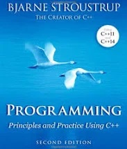

# PROGRAMMING Principles and Practices Using C++ 2nd Edition - Charpter Exercises
Answers to exercises in the textbook. Does not include all chapters and all questions.
It skips Chapter 1 and Chapter 2 since those first two chapters do not have significant coding exercises.

Author: Bjarne Stroustrup

## Chapters
- Chapter 3: Objects, Types, and Values